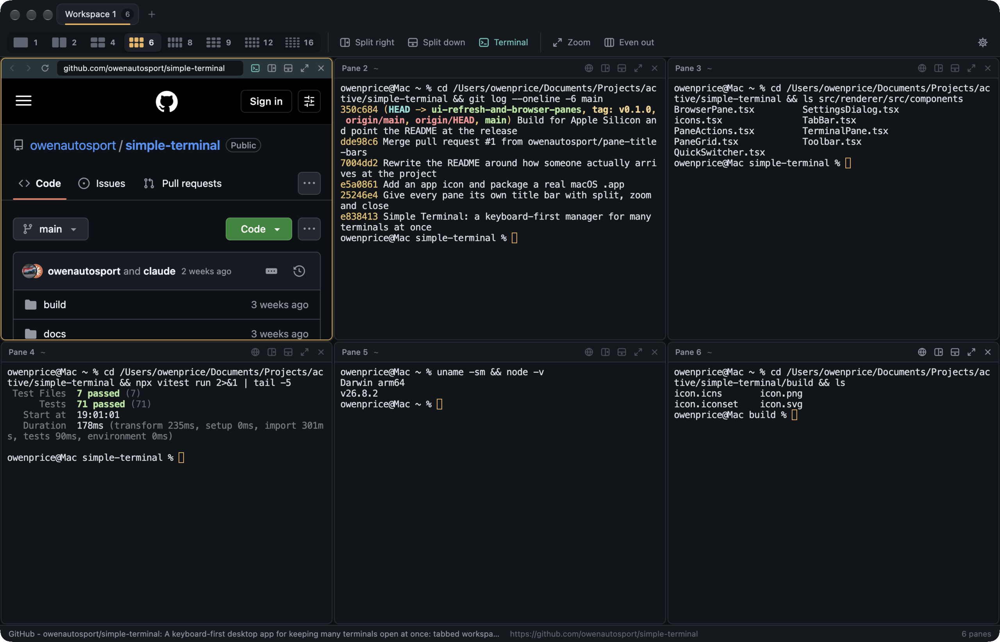

# Simple Terminal

A keyboard-first desktop app for keeping **many terminals open at once** — tabbed workspaces,
a resizable grid of live shells, one-click layout presets, and a layout that survives a
restart.

Built with Electron, node-pty and xterm.js. MIT licensed.



## What it does

- **Tabbed workspaces** — each tab is its own pane layout, renamed by double-clicking it
- **A title bar on every pane** — its name and directory, plus split-right, split-down, zoom
  and close buttons that act on *that* pane, whether or not it is the focused one
- **Split any pane** left/right or top/bottom; close a pane and the layout collapses cleanly
- **Layout presets** for 1, 2, 4, 6, 8, 9, 12 and 16 panes, plus **Tidy** to re-square the grid
- **Drag the dividers** to resize; the shell reflows as you go
- **Zoom** a pane to fill the window and back, without disturbing the others
- **Quick switcher** (`⌘P`) to jump to any pane in any workspace by name or directory
- **Find in terminal** (`⌘F`), jump-to-bottom when you have scrolled up, inline links
- **Persistence** — layouts, tab names and per-pane directories are restored on launch
- **Settings** — font, size, theme (dark/light), shell, scrollback

A pane whose shell exits stays where it is and offers a **Restart**, so a stray `exit` never
rearranges your grid. Only one instance runs at a time — a second launch focuses the existing
window rather than opening a rival window that would overwrite your saved layout.

## Shortcuts

| Action | macOS | Windows / Linux |
| --- | --- | --- |
| Split right | `⌘D` | `Ctrl+D` |
| Split down | `⇧⌘D` | `Ctrl+Shift+D` |
| Close pane | `⌘W` | `Ctrl+W` |
| Restart pane | `⌘R` | `Ctrl+R` |
| New tab | `⌘T` | `Ctrl+T` |
| Close tab | `⇧⌘W` | `Ctrl+Shift+W` |
| Move focus | `⌥⌘` + arrows | `Ctrl+Alt` + arrows |
| Zoom pane | `⇧⌘↩` | `Ctrl+Shift+Enter` |
| Tidy layout | `⇧⌘T` | `Ctrl+Shift+T` |
| Layout preset | `⌥⌘1`–`⌥⌘8` | `Ctrl+Alt+1`–`8` |
| Select tab | `⌘1`–`⌘9` | `Ctrl+1`–`9` |
| Quick switcher | `⌘P` | `Ctrl+P` |
| Find in terminal | `⌘F` | `Ctrl+F` |
| Clear terminal | `⌘K` | `Ctrl+K` |
| Settings | `⌘,` | `Ctrl+,` |

Shortcuts are native menu accelerators, so they work even while a terminal has focus.

## Installing it as a real app

```bash
npm install
npm run dist
```

That produces `release/Simple Terminal-<version>.dmg` and `release/mac/Simple Terminal.app`.
Drag the app into `/Applications`, open it, then right-click its Dock icon and choose
**Options → Keep in Dock** to pin it.

The build is not code-signed, so a copy downloaded from elsewhere would need
`xattr -dr com.apple.quarantine "/Applications/Simple Terminal.app"` before it will open. An
app you built yourself on your own machine opens without that.

### The icon

`build/icon.svg` is the source. Regenerate the macOS icon from it with:

```bash
for s in 16 32 128 256 512; do
  rsvg-convert -w $s   -h $s   build/icon.svg -o build/icon.iconset/icon_${s}x${s}.png
  rsvg-convert -w $((s*2)) -h $((s*2)) build/icon.svg -o build/icon.iconset/icon_${s}x${s}@2x.png
done
rsvg-convert -w 1024 -h 1024 build/icon.svg -o build/icon.png
iconutil -c icns build/icon.iconset -o build/icon.icns
```

## Running it

```bash
npm install
npm run dev     # development, with hot reload
npm run build   # typecheck + bundle
npm start       # run the built app
npm test        # unit tests + a real-pty integration test
npm run dist    # package a macOS app with electron-builder
```

Requires Node 20+ and a toolchain able to build native modules (`xcode-select --install` on
macOS). `node-pty` is rebuilt against Electron's ABI automatically after `npm install`, and is
unpacked from the asar archive when packaging — it loads a native binding and execs a helper,
neither of which works from inside an archive.

A development run and an installed build share the same saved workspaces, since both resolve
the same `userData` directory.

## How it is put together

```
src/main/       Electron main process — owns every pty, the store, and the menu
  sessions.ts     SessionRegistry: create / write / resize / kill, keyed by session id
  store.ts        workspaces.json, written atomically, corrupt files quarantined
  menu.ts         native menu and its accelerators
src/preload/    the only bridge to the renderer (contextIsolation on, no Node in the page)
src/renderer/   React UI
  layout/tree.ts  pure binary split tree: split, close, ratios, tidy, geometry, neighbours
  layout/presets  the 1–16 pane grids
  state/reducer   workspaces, panes and settings as one pure reducer
  components/     PaneGrid, TerminalPane, TabBar, Toolbar, QuickSwitcher, SettingsDialog
src/shared/     types, the preload API contract, preset sizes
```

Two decisions worth knowing:

- **Panes are absolutely positioned from computed geometry**, not nested in the shape of the
  tree. Re-parenting a live xterm would wipe its scrollback, so every terminal stays mounted
  under a stable key while the layout changes around it.
- **The layout maths and the reducer are pure functions** with no Electron or React imports,
  which is why they can be unit-tested directly — and that is where the tests are.

Keystrokes typed into a pane before its shell has finished starting are buffered in the
renderer and flushed once the pty exists, rather than being dropped.

## Not in this version

Command blocks (Warp-style collapsible per-command output) need OSC 133 shell integration and
are deferred to a later version, along with a file-browser sidebar and remote/SSH sessions.
Restored panes get fresh shells — ptys do not survive quitting the app.
