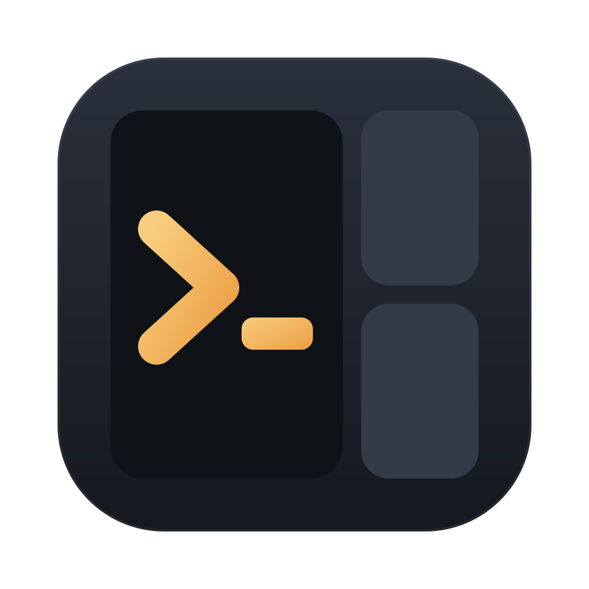

# Simple Terminal

**Keep many terminals open at once, without losing track of them.** Tabbed workspaces, a
resizable grid of live shells, one-click layout presets, and a layout that survives a restart.

<br clear="left">

Built with Electron, node-pty and xterm.js. MIT licensed.


## What it does

- **Tabbed workspaces** — each tab holds its own pane layout; double-click a tab to rename it
- **A title bar on every pane** — its name and directory, plus web, split-right, split-down,
  zoom and close buttons that act on *that* pane, whether or not it is the focused one
- **Split any pane** left/right or top/bottom; close one and the layout collapses cleanly — in
  a grid, the pane above or below grows into the gap
- **Layout presets** for 1, 2, 4, 6, 8, 9, 12 and 16 panes. Switching grids keeps the terminals
  you already have running and only adds fresh shells for the new slots; **Even out** makes every
  pane the same size again
- **Web panes** (`⇧⌘B`) — turn any pane into a small browser with its own address bar, for docs or
  the dev server you just started. The pane's shell keeps running while it shows the page, and
  switching back brings it straight back
- **Drag the dividers** to resize — the shell reflows as you drag
- **Zoom** a pane to fill the window and back, leaving the others running underneath
- **Quick switcher** (`⌘P`) — jump to any pane in any workspace by name or directory
- **Find in terminal** (`⌘F`), a jump-to-bottom button when you have scrolled up, clickable links
- **Persistence** — layouts, tab names and per-pane directories come back on launch
- **Settings** — font, size, theme (dark or light), shell, scrollback

A pane whose shell exits stays where it is and offers a **Restart**, so a stray `exit` never
rearranges your grid. Only one instance runs at a time: a second launch focuses the window you
already have rather than opening a rival that would overwrite your saved layout.

## Installing it

**macOS** — download the `.dmg` for your Mac from the
[latest release](https://github.com/owenautosport/simple-terminal/releases/latest):
`Simple Terminal-<version>.dmg` for an Intel Mac, `Simple Terminal-<version>-arm64.dmg` for
Apple Silicon. Open it and drag the app into `/Applications`.

The build is **not code-signed**, so the first launch needs its quarantine flag cleared —
otherwise macOS reports it as damaged:

```bash
xattr -dr com.apple.quarantine "/Applications/Simple Terminal.app"
```

Then open it as normal. To keep it around, right-click its Dock icon and choose
**Options → Keep in Dock**.

### Or build it yourself

```bash
npm install
npm run dist
```

That produces `release/Simple Terminal-<version>.dmg` and `release/mac/Simple Terminal.app`.
An app you built yourself opens without the quarantine step.

## Shortcuts

Every shortcut is a native menu accelerator, so it fires even while a terminal has keyboard
focus — no key has to be wrestled away from the shell.

| Action | macOS | Windows / Linux |
| --- | --- | --- |
| Split right | `⌘D` | `Ctrl+D` |
| Split down | `⇧⌘D` | `Ctrl+Shift+D` |
| Close pane | `⌘W` | `Ctrl+W` |
| Restart pane (reload, in a web pane) | `⌘R` | `Ctrl+R` |
| Switch pane to web / terminal | `⇧⌘B` | `Ctrl+Shift+B` |
| Go to address | `⌘L` | `Ctrl+L` |
| Zoom pane | `⇧⌘↩` | `Ctrl+Shift+Enter` |
| Move focus | `⌥⌘` + arrows | `Ctrl+Alt` + arrows |
| Even out panes | `⇧⌘T` | `Ctrl+Shift+T` |
| Layout preset | `⌥⌘1`–`⌥⌘8` | `Ctrl+Alt+1`–`8` |
| New tab | `⌘T` | `Ctrl+T` |
| Close tab | `⇧⌘W` | `Ctrl+Shift+W` |
| Select tab | `⌘1`–`⌘9` | `Ctrl+1`–`9` |
| Next / previous tab | `⌃⇥` / `⌃⇧⇥` | `Ctrl+Tab` / `Ctrl+Shift+Tab` |
| Quick switcher | `⌘P` | `Ctrl+P` |
| Find (in the terminal, or in the page) | `⌘F` | `Ctrl+F` |
| Clear terminal | `⌘K` | `Ctrl+K` |
| Bigger / smaller text | `⌘+` / `⌘-` | `Ctrl++` / `Ctrl+-` |
| Settings | `⌘,` | `Ctrl+,` |

## Development

```bash
npm install
npm run dev        # hot-reloading development run
npm run build      # typecheck all three projects, then bundle
npm start          # run the built output
npm test           # unit tests plus a real-pty integration test
npm run typecheck  # types only
npm run dist       # package the macOS app
```

Needs Node 20+ and a toolchain that can build native modules (`xcode-select --install` on
macOS). `node-pty` is rebuilt against Electron's ABI automatically after `npm install`.

Two things that are easy to trip over:

- **node-pty must be unpacked from the asar archive** when packaging. It loads a native binding
  and execs a `spawn-helper`, and neither works from inside an archive. `asarUnpack` in the
  electron-builder config handles it — and naming a `files` list at all replaces the default
  patterns, so `node_modules` has to be listed explicitly or the packaged app ships without it.
- **A development run and an installed build share the same saved workspaces**, because both
  resolve the same `userData` directory.
- **`npm run dist` leaves `node-pty` built for the last architecture it packaged** (arm64),
  which breaks the real-pty test on an Intel Mac. Run `npx electron-builder install-app-deps`
  to rebuild it for your own machine before `npm test`.

### Regenerating the icon

`build/icon.svg` is the source artwork: a tall pane holding an amber prompt, with two quieter panes
beside it. It is drawn small-first, so the prompt and the split still read at 16px.

```bash
mkdir -p build/icon.iconset
for s in 16 32 128 256 512; do
  rsvg-convert -w $s       -h $s       build/icon.svg -o build/icon.iconset/icon_${s}x${s}.png
  rsvg-convert -w $((s*2)) -h $((s*2)) build/icon.svg -o build/icon.iconset/icon_${s}x${s}@2x.png
done
rsvg-convert -w 1024 -h 1024 build/icon.svg -o build/icon.png
iconutil -c icns build/icon.iconset -o build/icon.icns
```

## How it is put together

```
src/main/         Electron main process — owns every pty, the store and the menu
  sessions.ts       SessionRegistry: create / write / resize / kill, keyed by session id
  store.ts          workspaces.json, written atomically, corrupt files quarantined
  menu.ts           the native menu and its accelerators
src/preload/      the only bridge to the renderer (contextIsolation on, no Node in the page)
src/renderer/     React UI
  layout/tree.ts    pure binary split tree: split, close, ratios, tidy, geometry, neighbours
  layout/presets    the 1–16 pane grids
  state/reducer     workspaces, panes and settings as one pure reducer
  components/       PaneGrid, TerminalPane, BrowserPane, TabBar, Toolbar, QuickSwitcher, …
src/shared/       types, the preload API contract, preset sizes, address-bar rules
```

Three decisions worth knowing:

- **Panes are absolutely positioned from computed geometry**, not nested in the shape of the
  layout tree. Re-parenting a live xterm would wipe its scrollback, so every terminal stays
  mounted under a stable key while the layout changes around it.
- **The layout maths and the reducer are pure functions**, with no Electron or React imports.
  That is why they can be tested directly, and it is where the tests are.
- **Web panes are Electron `<webview>` guests with nothing of the app in them**: no preload, no
  Node, sandboxed, and limited to http(s) addresses. Links that want a new window open in the
  same pane. Sites are refused camera, microphone, location, notifications and every other
  permission without a prompt. All web panes share one persistent session, so a login survives
  a restart.
- **Keystrokes typed before a pane's shell has started are buffered** in the renderer and
  flushed once the pty exists. The main process ignores writes to an unknown session, so
  without the buffer those keystrokes would vanish.

## Status

Version 0.1.0 — [download it here](https://github.com/owenautosport/simple-terminal/releases/latest).
Built, run and tested on macOS, on both Intel and Apple Silicon. The electron-builder config carries Windows and Linux
targets, but neither has been built or tested yet.

Not in this version: **command blocks** (Warp-style collapsible per-command output) need OSC 133
shell integration and are their own piece of work; likewise a file-browser sidebar and
remote/SSH sessions. Restored panes get fresh shells — ptys do not survive quitting the app.

## Licence

MIT — see [LICENSE](LICENSE).
